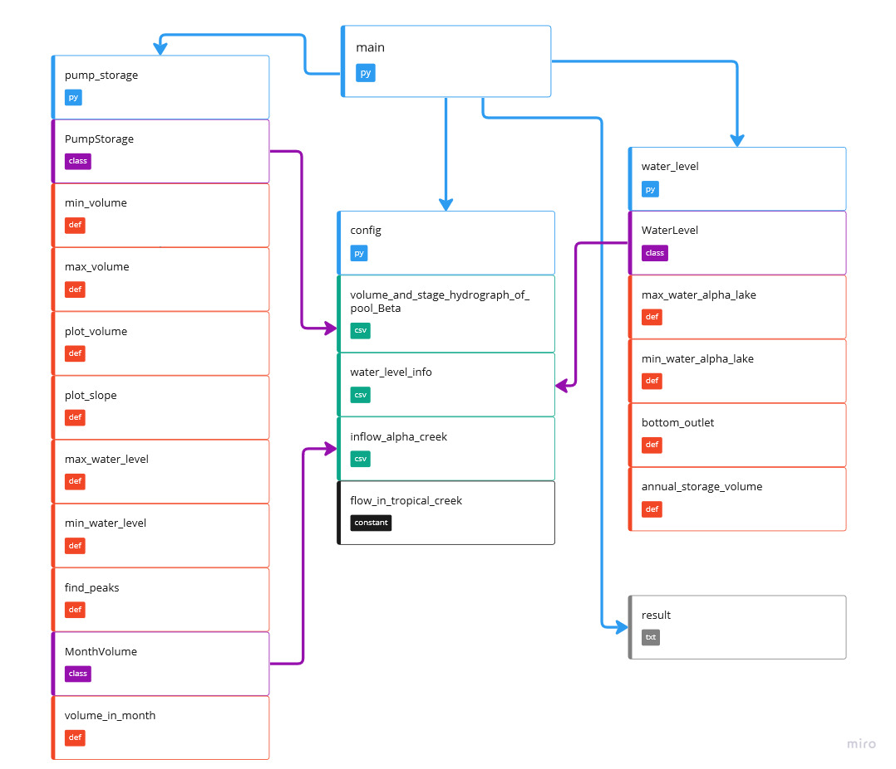

# Hydrological Analysis of Concrtete Gravity Dam System (Alphabeta Dam System)

Over the years we are witnessing that dams play multiple roles for people and governments in terms of hydropower, agriculture, drinking water, and so on. In order to do a proper project to have all the goals we have to consider all details of the topography of the location, purposes of governments at that rejoin, and national plans. 

## Detail of the Project

This project has consisted of a Lake called ALPHA with a concrete gravity dam and a reservoir Pool BETA with an earthen ring dam. Actually, there are two electricity generation plants in this project. One is in the pool Betha named LHPP and the second one is called UHPP.
In addition, the stage and volume hydrograph of pool Beta and the stage strong curve of alpha Lake is shown in the graph. These data are collected by the Water Administration of the country.

## Pre-processing of Flow Data
During the year different amounts of water are collected behind the dam from a river called Alphabeta Creek and they are shown in a Table.

## Goals
By using graphs, tables, and also information on the question, we are able to achieve
Pump storage volume in both lake and pool, time which pumps need for pumping, the maximum level of operational water which is called Zs, choosing the location of bottom outlet in the dam, annual storage volume of the lake and at the end, maximum and minimum head of pumps, plot volume chart, plot the inflow/outflow of Pool Beta over the hours of the day, the turbine discharge in the LHPP (Omega I) height in specific periods, maximum and minimum head for the UHPP electricity generation plants (Omega II).
all of results will be saved in result.txt file in root directory of project.

## Requirements
pandas==1.5.2 
matplotlib==3.6.2
numpy==1.24.2 
contourpy==1.0.7
cycler==0.11.0
fonttools==4.38.0
kiwisolver==1.4.4
matplotlib~=3.6.2
packaging==23.0
Pillow==9.4.0
pyparsing==3.0.9
python-dateutil==2.8.2
pytz==2022.7.1
scipy==1.10.0
six==1.16.0
graphics.py==5.0.1.post1 
config==0.5.1


## Calculation
•	Pump storage volume is the volume of the reservoir (excluding dead volume) that is used for storing the potential energy. In this case, the potential energy is being stored in the Beta Pool. So this volume can be seen as a difference between the maximum and minimum the volume of water in the Beta Pool (up)

        Vpump = Vmax, up – Vmin, up

•	that Maximum operational water level in a reservoir can be seen as the level of its overflow gate.

•	Bottom Outlet is located at the deepest drawdown level


•	Annual storage volume of a reservoir is the volume of the reservoir without dead
volume, and pump storage volume.

          Vannual, alpha = Vmax, alpha – Vmin, alpha – Vpump


•	Maximum Head for UHPP happens when Upper Reservoir in its maximum level and Lake Alpha in its minimum level.
                              
               
               Δhmax, UHPP = hmax, up – hmin, alpha 

               Δhmin, UHPP = hmin, up – hmax, alpha 

• Turbine discharge in the LHPP (Omega I) height between may untill augest 
  
         Vout,alpha,may-aug = Vannal-alpha + Vin,alpha-may-aug
         Qout,alpha,may-aug = QLHPP + Qabc

## Code Diagram 

## Usage 
this project calculate parameter below (it was show in calculation section) based on csv file contains data. 
these files are identified in data directory and read with config module in python. you can replace it with path of your desired csv file.

```python
    pump_storage = PumpStorage(CSV_PATH['reservoir'])
    water_level = WaterLevel(CSV_PATH['water_level'])
    month_volume = MonthVolume(CSV_PATH['inflow_alpha_creek'])
```

after activating virtual env of this project, you have to install dependancies which is stored in requirements.txt file with this command:
```python
    pip install -r requirements.txt
```
just run:
```python
    python main.py
```
to start project.

## Code description
'main.py' file use two python module. 'PumpStorage' is module contains class and fuctions to calculate space and storage of pump volume and also there is another class called MonthVolume to calculate volume of lake in specefic month and 'WaterLevel' package contains class and fuctions to calculate level of water.
 there is 'PumpStorage' class in 'PumpStorage' package. 
 ```python
class PumpStorage:
    """
    Author: Amirreza
    """

    def __init__(self, csv_file):
        self.csv_file = csv_file
        self.df_new = pd.read_csv(self.csv_file,
                                  names=["hours", "volumes", "water_level"],
                                  header=0,
                                  sep=",",
                                  encoding="latin1")
        # save local minimum of plot of data
        self.df_new['min'] = self.df_new.hours[
            (self.df_new.volumes.shift(1) >= self.df_new.volumes) &
            (self.df_new.volumes.shift(-1) > self.df_new.volumes)
            ]
        # save local maximum of plot of data
        self.df_new['max'] = self.df_new.hours[
            (self.df_new.volumes.shift(1) <= self.df_new.volumes) &
            (self.df_new.volumes.shift(-1) < self.df_new.volumes)
            ]
```
min_volume and max_volume and plot_volume are functions of  'PumpStorage' class.
min_volume: returns minimum volume of pump storage
```python
    def min_volume(self):
        """
        :return:  minimum volume of lake
        """
        sorted_data = self.df_new.sort_values(["volumes"])
        min_volume = sorted_data["volumes"].min()
        try:
            result = int(min_volume)
            return result
        except Exception as e:
            return str(e)
```
max_volume:  returns maximum volume of pump storage
```python
    def max_volume(self):
        """
        :return: maximum volume of lake
        """
        sorted_data = self.df_new.sort_values(["volumes"])
        max_volume = sorted_data["volumes"].max()
        try:
            result = int(max_volume)
            return result
        except Exception as e:
            return str(e)

```
plot_volume: just show plot of data
```python
    def plot_volume(self):
        """
        :return: plot data volume based on data
        """
        self.df_new.plot(x="hours", y="volumes")
        plt.ion()  # enables interactive mode
        plt.show()
```
plot_slope: plot the inflow/outflow of Pool Beta over the hours of the day
```python
    def plot_slope(self):
        """
        :return: plot the slop of volume chart
        """
        dict_value = {
            0: 1.0, 3: 0.0, 5: -1.0, 7: -3.0, 8: -2.0, 9: 1.0, 12: -1.0, 14: 1.0, 18: -2.0, 19: -1.0, 21: 1.0
        }
        values = pd.Series(dict_value)
        slop_df = self.df_new['volumes'].diff() // self.df_new['hours'].diff()
        target = pd.concat([slop_df, values])
        tar_df = pd.DataFrame({"hours": target.index, "slopes": target.values})
        tar_df_sort = tar_df.sort_values(["hours"])
        tmp = tar_df_sort.loc[14]
        tar_df_sort.loc[14] = tar_df_sort.loc[32]
        tar_df_sort.loc[32] = tmp
        tar_df_sort.plot(x='hours', y='slopes')
        plt.ion()  # enables interactive mode
        plt.show()
```
max_water_level: maximum level in Upper Reservoir and its time or period
```python
   def max_water_level(self):
        """
        :return: maximum of water level of lake
        """
        sorted_data = self.df_new.sort_values(["water_level"])
        max_level = sorted_data["water_level"].max()
        start_time = self.df_new.loc[self.df_new['water_level'] == max_level, 'hours'].iloc[0]
        end_time = self.df_new.loc[self.df_new['water_level'] == max_level, 'hours'].iloc[-1]
        target = {
            'max_level': max_level,
            'start_time': start_time,
            'end_time': end_time
        }
        return target
```
min_water_level: minimum level in Upper Reservoir and its time or period
```python
    def min_water_level(self):
        """
        :return: minimum water level of lake
        """
        sorted_data = self.df_new.sort_values(["water_level"])
        min_level = sorted_data["water_level"].min()
        end_time = self.df_new.loc[self.df_new['water_level'] == min_level, 'hours'].iloc[-1]
        target = [min_level, end_time]
        return target
```
there is 'find_peaks' fuction which find point that derivative of plot is zero.
the goal of finding these points is identify ascending and descending range of plot.
```python
    def find_peaks(self):
        """
        :return: the peaks of charts (mins and maxs) 
        """
        result = []
        if self.df_new["max"][self.df_new["max"].notnull()].iloc[0] < \
                self.df_new["min"][self.df_new["min"].notnull()].iloc[0]:
            for i in range(self.df_new['max'].count()):
                if i == range(self.df_new['max'].count())[-1] and \
                        self.df_new["min"][self.df_new["min"].notnull()].iloc[-1] > \
                        self.df_new["max"][self.df_new["max"].notnull()].iloc[-1]:
                    result.append(
                        f'time of pumping: {self.df_new["min"][self.df_new["min"].notnull()].iloc[-1]} '
                        f'until {self.df_new["hours"].iloc[3]}'
                    )
                else:
                    result.append(
                        f'time of pumping: {self.df_new["min"][self.df_new["min"].notnull()].iloc[i]} '
                        f'until {self.df_new["max"][self.df_new["max"].notnull()].iloc[i + 1]}'
                    )
            for i in range(self.df_new['min'].count()):
                result.append(
                    f'time of turbining: {self.df_new["max"][self.df_new["max"].notnull()].iloc[i]} '
                    f'until {self.df_new["min"][self.df_new["min"].notnull()].iloc[i]}'
                )
                if i == range(
                        self.df_new['min'].count())[-1] and \
                        self.df_new["max"][self.df_new["max"].notnull()].iloc[-1] > \
                        self.df_new["min"][self.df_new["min"].notnull()].iloc[i]:
                    result.append(
                        f'time of turbining: {self.df_new["max"][self.df_new["max"].notnull()].iloc[-1]} '
                        f'until {self.df_new["hours"].iloc[-1]}'
                    )
        else:
            for i in range(self.df_new['max'].count()):
                if i == range(
                        self.df_new['max'].count())[-1] and \
                        self.df_new["min"][self.df_new["min"].notnull()].iloc[-1] > \
                        self.df_new["max"][self.df_new["max"].notnull()].iloc[-1]:
                    result.append(
                        f'time of pumping: {self.df_new["min"][self.df_new["min"].notnull()].iloc[-1]} '
                        f'until {self.df_new["hours"].iloc[-1]}')
                else:
                    result.append(
                        f'time of pumping: {self.df_new["min"][self.df_new["min"].notnull()].iloc[i]} '
                        f'until {self.df_new["max"][self.df_new["max"].notnull()].iloc[i]}'
                    )
            for i in range(self.df_new['min'].count()):
                result.append(
                    f'time of turbining: {self.df_new["max"][self.df_new["max"].notnull()].iloc[i]} '
                    f'until {self.df_new["min"][self.df_new["min"].notnull()].iloc[i]}'
                )
                if i == range(
                        self.df_new['min'].count())[-1] and \
                        self.df_new["max"][self.df_new["max"].notnull()].iloc[-1] > \
                        self.df_new["min"][self.df_new["min"].notnull()].iloc[i]:
                    result.append(
                        f'time of turbining: {self.df_new["max"][self.df_new["max"].notnull()].iloc[-1]} '
                        f'until {self.df_new["hours"].iloc[-1]}'
                    )
        return result
```
also there is another class for calculating volume in specific month 
```python
class MonthVolume:
    """
    Author: Navid
    """

    def __init__(self, csv_file):
        self.csv_file = csv_file
        self.df_new = pd.read_csv(self.csv_file,
                                  names=["month", "volumes"],
                                  header=0,
                                  sep=",",
                                  encoding="latin1")
```
volume_in_month: function calculate volume in month that get as parameter
```python
    def volume_in_month(self, month):
        """
        :param month: entry is name of month 
        :return: calculate volume in one moth
        """
        volume = int(self.df_new.loc[self.df_new['month'] == month, 'volumes'].iloc[0])
        return volume * 30 * 24 * 3600
```

in 'WaterLevel' module there is 'WaterLevel' class.
```python
class WaterLevel:
    """
    Author: Navid
    """
    def __init__(self, csv_file):
        self.csv_file = csv_file
        self.my_data = np.loadtxt(self.csv_file, dtype=str, delimiter=',', skiprows=0)

```
there is 4 function in this class 'max_water_alpha_lake' , 'annual_storage_volume' , 'bottom_outlet' , 'min_water_alpha_lake'.
max_water_alpha_lake: calculate maximum of alpha lake.
min_water_alpha_lake:  calculate minimum of alpha lake.
bottom_outlet: find bottom outlet of alpha lake.
annual_storage_volume: calculate annual storage volume of lake.
```python
    def max_water_alpha_lake(self):
        """
        :return: maximum of water level of alpha lake 
        """
        return self.my_data[self.my_data[:, 0] == 'ZO', :][0][2]

    def min_water_alpha_lake(self):
        """
        :return: minimum of water level of alpha lake
        """
        return self.my_data[self.my_data[:, 0] == 'ZA', :][0][2]

    def bottom_outlet(self):
        """
        :return: level of bottom outlet  
        """
        return self.my_data[self.my_data[:, 0] == 'ZT', :][0][2]

    def annual_storage_volume(self, pump_volume):
        """
        :param pump_volume: entry of pumping volume
        :return: calculate annual storage
        """
        volume_max_height = self.my_data[self.my_data[:, 0] == 'ZO', :][0][3]
        volume_min_height = self.my_data[self.my_data[:, 0] == 'ZA', :][0][3]
        return int(volume_max_height) - int(volume_min_height) - int(pump_volume)

```
and in 'main.py' file just we use these modules to find our wanted information from data, and there is a graphic display of results in window as well. It is noticeable that the results will be saved in results.txt.

